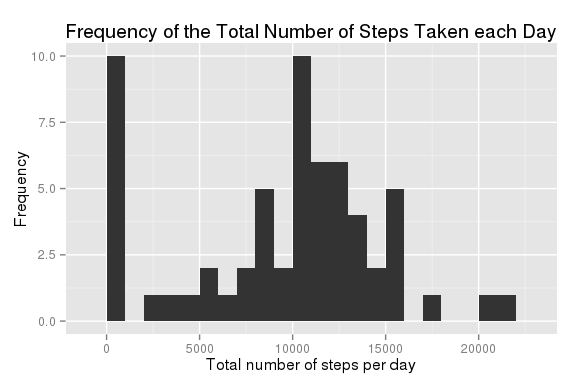
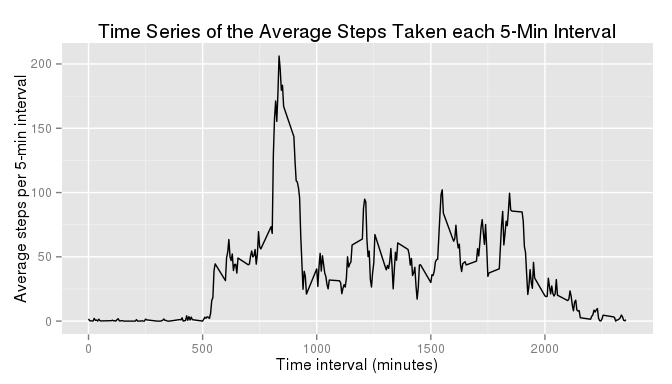
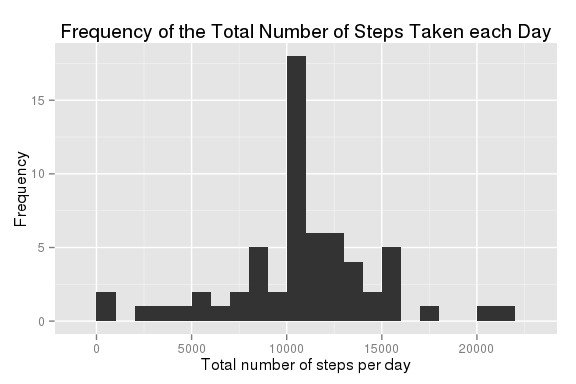
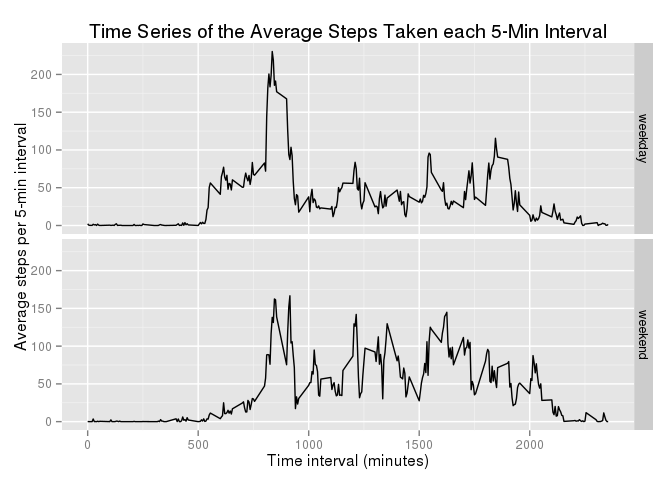

# Reproducible Research: Peer Assessment 1
#### Agus Arif, 15-06-2015


The libraries which are required for this project:

```r
library(dplyr)
library(ggplot2)
```

## Loading and preprocessing the data

Since the zipped dataset has existed in the current folder then it will be extracted to give the dataset inside a CSV file:

```r
unzip("./activity.zip")
dir()
```

```
##  [1] "activity.csv"       "activity.zip"       "doc"               
##  [4] "instructions_fig"   "PA1_template_files" "PA1_template.html" 
##  [7] "PA1_template.md"    "PA1_template.pdf"   "PA1_template.Rmd"  
## [10] "README.md"
```

```r
fileName <- "activity.csv"
activity <- read.csv(fileName)
activity <- tbl_df(activity)
```

After reading the dataset from its CSV file, its dataframe form has been transformed to a table form. The structure and partial content of the table are displayed below:

```r
str(activity)
```

```
## Classes 'tbl_df', 'tbl' and 'data.frame':	17568 obs. of  3 variables:
##  $ steps   : int  NA NA NA NA NA NA NA NA NA NA ...
##  $ date    : Factor w/ 61 levels "2012-10-01","2012-10-02",..: 1 1 1 1 1 1 1 1 1 1 ...
##  $ interval: int  0 5 10 15 20 25 30 35 40 45 ...
```

```r
summary(activity)
```

```
##      steps                date          interval     
##  Min.   :  0.00   2012-10-01:  288   Min.   :   0.0  
##  1st Qu.:  0.00   2012-10-02:  288   1st Qu.: 588.8  
##  Median :  0.00   2012-10-03:  288   Median :1177.5  
##  Mean   : 37.38   2012-10-04:  288   Mean   :1177.5  
##  3rd Qu.: 12.00   2012-10-05:  288   3rd Qu.:1766.2  
##  Max.   :806.00   2012-10-06:  288   Max.   :2355.0  
##  NA's   :2304     (Other)   :15840
```

```r
activity
```

```
## Source: local data frame [17,568 x 3]
## 
##    steps       date interval
## 1     NA 2012-10-01        0
## 2     NA 2012-10-01        5
## 3     NA 2012-10-01       10
## 4     NA 2012-10-01       15
## 5     NA 2012-10-01       20
## 6     NA 2012-10-01       25
## 7     NA 2012-10-01       30
## 8     NA 2012-10-01       35
## 9     NA 2012-10-01       40
## 10    NA 2012-10-01       45
## ..   ...        ...      ...
```

## What is mean total number of steps taken per day?

To calculate the total number of steps taken per day, first the dataset must be grouped based on the sampling date. Then all steps for a particular date are summed by ignoring the missing values or NAs.

```r
byDate <- group_by(activity, date)
stepsADay <- summarise(byDate, total.steps = sum(steps, na.rm = TRUE))
stepsADay
```

```
## Source: local data frame [61 x 2]
## 
##          date total.steps
## 1  2012-10-01           0
## 2  2012-10-02         126
## 3  2012-10-03       11352
## 4  2012-10-04       12116
## 5  2012-10-05       13294
## 6  2012-10-06       15420
## 7  2012-10-07       11015
## 8  2012-10-08           0
## 9  2012-10-09       12811
## 10 2012-10-10        9900
## ..        ...         ...
```

The histogram of the total number of steps taken per day is shown below:

```r
g <- ggplot(stepsADay, aes(total.steps))
g <- g + geom_histogram(binwidth = 1000)
g <- g + ggtitle("Frequency of the Total Number of Steps Taken each Day")
g <- g + xlab("Total number of steps per day") + ylab("Frequency")
g
```

 

To calculate the mean and median of total number of steps taken per day, the following codes must be executed:

```r
meanSteps <- summarise(stepsADay, mean(total.steps))
meanSteps <- as.numeric(meanSteps)
meanSteps
```

```
## [1] 9354.23
```

```r
medianSteps <- summarise(stepsADay, median(total.steps))
medianSteps <- as.numeric(medianSteps)
medianSteps
```

```
## [1] 10395
```

Hence, the mean is __9354.23__ and the median is **10395**.

## What is the average daily activity pattern?

To determine the average daily activity pattern, the average steps taken per 5-minute interval across all days must be calculated. First, the dataset is grouped based on each 5-minute interval, and then the average number of steps for each group are computed using these codes:

```r
byInterval <- group_by(activity, interval)
stepsIn5Min <- summarise(byInterval, average.steps = mean(steps, na.rm = TRUE))
stepsIn5Min
```

```
## Source: local data frame [288 x 2]
## 
##    interval average.steps
## 1         0     1.7169811
## 2         5     0.3396226
## 3        10     0.1320755
## 4        15     0.1509434
## 5        20     0.0754717
## 6        25     2.0943396
## 7        30     0.5283019
## 8        35     0.8679245
## 9        40     0.0000000
## 10       45     1.4716981
## ..      ...           ...
```

After that, a time series of the average steps taken per 5-minute interval is plotted:

```r
g <- ggplot(stepsIn5Min, aes(interval, average.steps))
g <- g + geom_line()
g <- g + ggtitle("Time Series of the Average Steps Taken each 5-Min Interval")
g <- g + xlab("Time interval (minutes)")
g <- g + ylab("Average steps per 5-min interval")
g
```

 

To specify the 5-minute interval which contains the maximum number of steps across all days, the following codes should be run:

```r
maxSteps <- filter(stepsIn5Min, average.steps == max(average.steps))
interval_maxSteps <- select(maxSteps, interval)
interval_maxSteps <- as.numeric(interval_maxSteps)
interval_maxSteps
```

```
## [1] 835
```

Hence, the maximum number of steps is contained within the 5-minute interval number: **835**.

## Imputing missing values

The total number of missing values in the column 'steps' of the dataset could determined using the following codes:

```r
indexNA <- is.na(activity$steps)
missValue <- sum(indexNA)
missValue
```

```
## [1] 2304
```

Therefore, the total number of missing values is __2304__. These missing values of the column 'steps' will be imputed by the average number of steps in the corresponding 5-minute interval, which have been calculated in the previous step of this report.

First, the original dataset will be merged with the table of steps within 5-minute interval to create a new dataset:

```r
activity1 <- merge(x = activity, y = stepsIn5Min, by = "interval")
activity1 <- tbl_df(activity1)
activity1 <- arrange(activity1, date)
```

Next, all NAs in the column 'steps' will be filled with the average steps for the corresponding 5-minute interval:

```r
indexNA <- is.na(activity1$steps)
activity1$steps[indexNA] <- activity1$average.steps[indexNA]
activity1 <- select(activity1, steps, date, interval)
activity1
```

```
## Source: local data frame [17,568 x 3]
## 
##        steps       date interval
## 1  1.7169811 2012-10-01        0
## 2  0.3396226 2012-10-01        5
## 3  0.1320755 2012-10-01       10
## 4  0.1509434 2012-10-01       15
## 5  0.0754717 2012-10-01       20
## 6  2.0943396 2012-10-01       25
## 7  0.5283019 2012-10-01       30
## 8  0.8679245 2012-10-01       35
## 9  0.0000000 2012-10-01       40
## 10 1.4716981 2012-10-01       45
## ..       ...        ...      ...
```

Then, just like before, the histogram of the total number of steps taken per day is plotted:

```r
byDate <- group_by(activity1, date)
stepsADay <- summarise(byDate, total.steps = sum(steps))
stepsADay
```

```
## Source: local data frame [61 x 2]
## 
##          date total.steps
## 1  2012-10-01    10766.19
## 2  2012-10-02      126.00
## 3  2012-10-03    11352.00
## 4  2012-10-04    12116.00
## 5  2012-10-05    13294.00
## 6  2012-10-06    15420.00
## 7  2012-10-07    11015.00
## 8  2012-10-08    10766.19
## 9  2012-10-09    12811.00
## 10 2012-10-10     9900.00
## ..        ...         ...
```

```r
g <- ggplot(stepsADay, aes(total.steps))
g <- g + geom_histogram(binwidth = 1000)
g <- g + ggtitle("Frequency of the Total Number of Steps Taken each Day")
g <- g + xlab("Total number of steps per day") + ylab("Frequency")
g
```

 

Finally, the mean and median of total number of steps taken per day are calculated:

```r
meanSteps <- summarise(stepsADay, mean(total.steps))
meanSteps <- as.numeric(meanSteps)
meanSteps
```

```
## [1] 10766.19
```

```r
medianSteps <- summarise(stepsADay, median(total.steps))
medianSteps <- as.numeric(medianSteps)
medianSteps
```

```
## [1] 10766.19
```

This time, the mean is __10766.19__ and the median is **10766.19**, which are the same incidentally. These values are different from the corresponding values of mean and median when the missing values in the original dataset are ignored in the previous estimations.

By comparing the two histograms above, it could be seen that one impact of imputing missing data is there is no high values in the lower-side of the number of steps taken each day. In other words, all NA values the column 'steps' have been replaced by some positive values. 

## Are there differences in activity patterns between weekdays and weekends?

To compare the activity patterns between weekdays and weekends, two new variables are created in the the dataset with the filled-in missing values: weekdays and type of weekdays.

```r
activity1 <- mutate(activity1, day = weekdays(as.Date(date, "%Y-%m-%d")))
activity1 <- mutate(activity1, day.type = rep("weekday", dim(activity1)[1]))
activity1[1436:1445, ]
```

```
## Source: local data frame [10 x 5]
## 
##    steps       date interval      day day.type
## 1      0 2012-10-05     2335   Friday  weekday
## 2      0 2012-10-05     2340   Friday  weekday
## 3      0 2012-10-05     2345   Friday  weekday
## 4      0 2012-10-05     2350   Friday  weekday
## 5      0 2012-10-05     2355   Friday  weekday
## 6      0 2012-10-06        0 Saturday  weekday
## 7      0 2012-10-06        5 Saturday  weekday
## 8      0 2012-10-06       10 Saturday  weekday
## 9      0 2012-10-06       15 Saturday  weekday
## 10     0 2012-10-06       20 Saturday  weekday
```

In the previous step, the column 'weekday' initially has been filled-up with strings of "weekday" througout its rows, but now some of the stings will be replaced with "weekend" according to the appropriate type of day at the corresponding date:

```r
indexWEnd <- activity1$day %in% c("Saturday", "Sunday")
activity1$day.type[indexWEnd] <- "weekend"
activity1$day.type <- factor(activity1$day.type)
activity1 <- select(activity1, steps, date, interval, day.type)
activity1[1436:1445, ]
```

```
## Source: local data frame [10 x 4]
## 
##    steps       date interval day.type
## 1      0 2012-10-05     2335  weekday
## 2      0 2012-10-05     2340  weekday
## 3      0 2012-10-05     2345  weekday
## 4      0 2012-10-05     2350  weekday
## 5      0 2012-10-05     2355  weekday
## 6      0 2012-10-06        0  weekend
## 7      0 2012-10-06        5  weekend
## 8      0 2012-10-06       10  weekend
## 9      0 2012-10-06       15  weekend
## 10     0 2012-10-06       20  weekend
```

In the previous table, the column 'day.type' has been transformed to a factor class and the column 'day' has been dropped since it has no use anymore.

Next, the dataset are divided into two separate tables. The first table contains only the weekends data which then can be used to create a table of the average number of steps per 5-minute interval:

```r
activityWE <- filter(activity1, day.type == "weekend")
activityWE <- select(activityWE, -day.type)
byInterval <- group_by(activityWE, interval)
steps5MinWE <- summarise(byInterval, average.steps = mean(steps))
steps5MinWE <- mutate(steps5MinWE, day.type = rep("weekend", dim(steps5MinWE)[1]))
steps5MinWE
```

```
## Source: local data frame [288 x 3]
## 
##    interval average.steps day.type
## 1         0   0.214622642  weekend
## 2         5   0.042452830  weekend
## 3        10   0.016509434  weekend
## 4        15   0.018867925  weekend
## 5        20   0.009433962  weekend
## 6        25   3.511792453  weekend
## 7        30   0.066037736  weekend
## 8        35   0.108490566  weekend
## 9        40   0.000000000  weekend
## 10       45   0.558962264  weekend
## ..      ...           ...      ...
```

The second table contains only the weekdays data which then can be used to create another similar table of the average number of steps within 5-minute interval:

```r
activityWD <- filter(activity1, day.type == "weekday")
activityWD <- select(activityWD, -day.type)
byInterval <- group_by(activityWD, interval)
steps5MinWD <- summarise(byInterval, average.steps = mean(steps))
steps5MinWD <- mutate(steps5MinWD, day.type = rep("weekday", dim(steps5MinWD)[1]))
steps5MinWD
```

```
## Source: local data frame [288 x 3]
## 
##    interval average.steps day.type
## 1         0    2.25115304  weekday
## 2         5    0.44528302  weekday
## 3        10    0.17316562  weekday
## 4        15    0.19790356  weekday
## 5        20    0.09895178  weekday
## 6        25    1.59035639  weekday
## 7        30    0.69266247  weekday
## 8        35    1.13794549  weekday
## 9        40    0.00000000  weekday
## 10       45    1.79622642  weekday
## ..      ...           ...      ...
```

Then both tables are combined together:

```r
stepsIn5Min <- rbind(steps5MinWE, steps5MinWD)
stepsIn5Min
```

```
## Source: local data frame [576 x 3]
## 
##    interval average.steps day.type
## 1         0   0.214622642  weekend
## 2         5   0.042452830  weekend
## 3        10   0.016509434  weekend
## 4        15   0.018867925  weekend
## 5        20   0.009433962  weekend
## 6        25   3.511792453  weekend
## 7        30   0.066037736  weekend
## 8        35   0.108490566  weekend
## 9        40   0.000000000  weekend
## 10       45   0.558962264  weekend
## ..      ...           ...      ...
```

Finally, just like before, a time series of the average steps taken per 5-minute interval is plotted for each type of day:

```r
g <- ggplot(stepsIn5Min, aes(interval, average.steps))
g <- g + geom_line()
g <- g + facet_grid(day.type ~ .)
g <- g + ggtitle("Time Series of the Average Steps Taken each 5-Min Interval")
g <- g + xlab("Time interval (minutes)")
g <- g + ylab("Average steps per 5-min interval")
g
```

 

Based on the comparison of those two time series plots, it can be concluded that the activity patterns in weekdays and weekends are certainly different.
